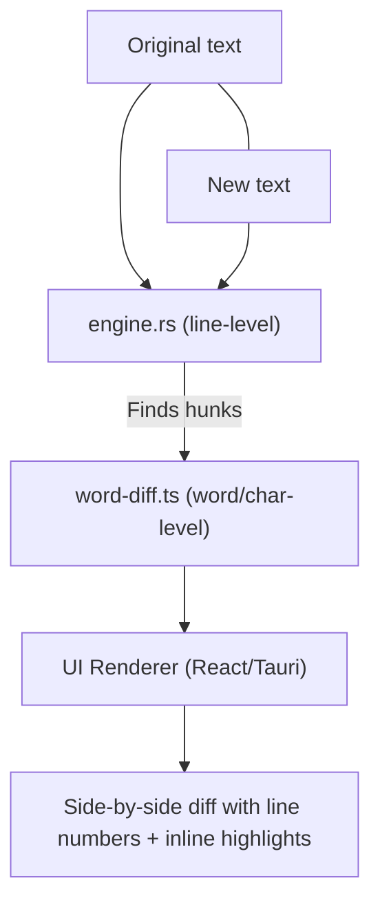

# JiffyDiffy

A desktop app for visualizing **text differences** with both **line-level** and **word-level** highlighting.  
Built with **Tauri + React + TypeScript** on the frontend, and **Rust** on the backend for fast diff computation.

---

## How It Works

The diffing is a two-stage process:

1. **Line-level diff (Rust – `engine.rs`)**
   - Uses the [`similar`](https://crates.io/crates/similar) crate (Myers / Patience).
   - Finds changed blocks of lines (**hunks**) with line numbers and context.
   - Optimized for large files.

2. **Word-level diff (TypeScript – `word-diff.ts`)**
   - Runs only on lines flagged as changed by the Rust stage.
   - Tokenizes into words + whitespace and marks insertions/deletions for fine-grained highlights.

3. **UI (React + Tauri)**
   - Side-by-side rendering:
     - Original text (deletions marked)
     - New text (insertions marked)
   - Shows line numbers, hunk context, and inline highlights.

---

## System Flow

### Mermaid (GitHub-rendered)


### ASCII (fallback)
```text
          ┌───────────────┐
 Original │               │ New
  text    │    Strings    │ text
          └───────┬───────┘
                  │
                  ▼
          ┌─────────────────┐
          │   engine.rs     │
          │   (line-level)  │
          └─────────────────┘
                  │
        Finds "hunks" (changed blocks of lines)
                  │
                  ▼
        ┌────────────────────┐
        │   word-diff.ts     │
        │ (word/char-level)  │
        └────────────────────┘
                  │
   Zooms in on changed lines: marks insertions/deletions
                  │
                  ▼
          ┌─────────────────┐
          │   UI Renderer   │
          │   (React/Tauri) │
          └─────────────────┘
                  │
        Side-by-side diff with line numbers + highlights
```

---

## Tech Stack

- **Frontend:** React (Vite), TypeScript (`word-diff.ts`), CSS/Tailwind
- **Backend:** Rust (Tauri commands), `similar` crate (`engine.rs`) exposed via `invoke()`
- **App shell:** [Tauri](https://tauri.app)

---

## Development

### Prerequisites
- Rust
- Node.js (npm or pnpm)
- Tauri CLI deps (see Tauri docs)

### Run (dev)
```bash
npm install
npm run tauri dev
```

### Build
```bash
npm run tauri build
```

---

## Recommended IDE Setup
- VS Code
- Tauri extension
- rust-analyzer

---

## Project Status
- ✅ Line-level diff in Rust
- ✅ Word-level highlights in TypeScript
- 🚧 UI polish & perf
- 🚧 Config options (context lines, ignore-case/whitespace)

---

## License
MIT
